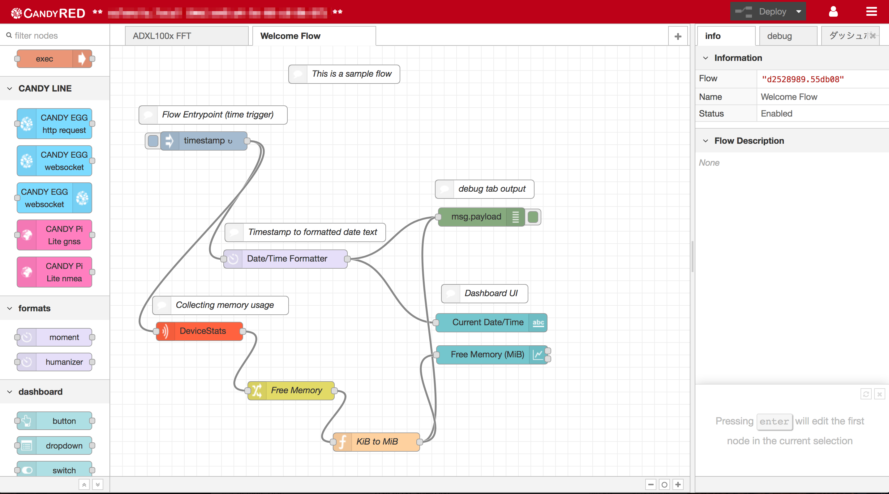
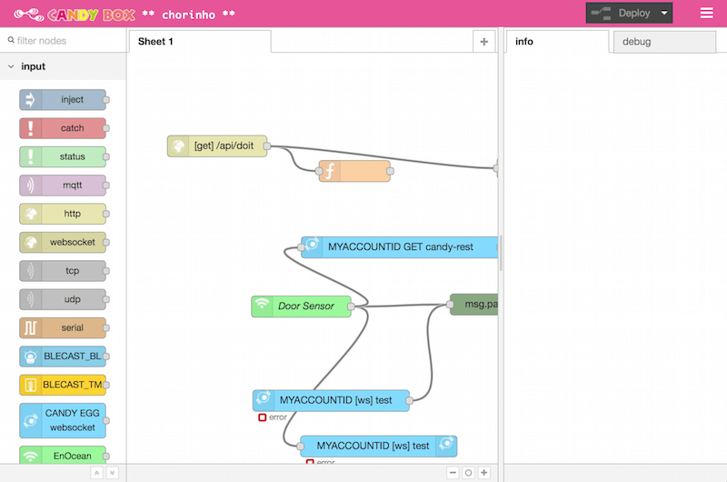

CANDY RED
===

[](https://github.com/dbaba/candy-red/releases/latest)
[](https://travis-ci.org/dbaba/candy-red/)
[](http://opensource.org/licenses/MIT)

CANDY RED is a gateway service working between local area wireless network devices and internet servers.

## Features

* Include Node-RED flow editor/flow execution runtime
* BLE and EnOcean nodes (which will be published to npm in the future release)
* Dedicated nodes for CANDY EGG cloud services offering you to connect your server side flows with ease\*
* Flow file syncing (both to be delivered and to upload to the cloud)\*

_\* CANDY EGG cloud services are required_

## OS and Hardwares

* [Intel Edison + Yocto](#intel-edison--yocto)
* [Raspberry Pi + Raspbian](#raspberry-pi--raspbian)
* [OSX/Linux for Development](#development)

# Screenshots
## CANDY RED flow editor page on browser

This is the default screen theme.



## CANDY BOX flow editor page on browser

This theme appears when CANDY IoT Board is available on a device.



# Intel Edison + Yocto

## Prerequisites

### Tested Node.js versions

* v0.10.38 (preinstalled)

## Version up

Go to [Install](#install) if you've never installed the project.

```
$ $(npm root -g)/candy-red/install.sh
```

This will install the latest version of CANDY RED.

## Install

The installation will take a couple of minutes.

You can ignore `npm WARN`s, `gyp WARN`s, `gyp ERR!`s and `node-pre-gyp ERR!`s unless the installation terminates normally. You can check if the installation is successful by `systemctl status candy-red` command.

```
$ VERSION=2.0.1
$ npm install -g --unsafe-perm https://github.com/dbaba/candy-red/archive/${VERSION}.tar.gz
$ $(npm root -g)/candy-red/install.sh
```

## Stop/Start/Status Service

The service name is `candy-red`.

```
$ systemctl stop candy-red
$ systemctl start candy-red
$ systemctl status candy-red
```

## Uninstall

```
$ $(npm root -g)/candy-red/uninstall.sh
```

If you run `npm uninstall -g candy-red` prior to run the `uninstall.sh`, please run the following commands in order to reset systemd configurations.

```
$ systemctl stop candy-red
$ systemctl disable candy-red
$ rm -f "$(dirname $(dirname $(which systemctl)))/lib/systemd/system/candy-red.service"
```

# Raspberry Pi + Raspbian

## Prerequisites

### Raspbian version

 * 4.1 (2015-11-21)

### Tested Node.js versions

* v0.12.6

The preinstalled version of Node.js v0.10.29 won't work because of the [header file issue](http://dustinbolton.com/replace_invalid_utf8-is-not-a-member-of-v8string-installing-nodejs-packages-on-raspbian-debian-on-raspberry-pi-2-b/) appearing on installing native addons.

I highly recommend you to uninstall the preinstalled version of Node.js, Node-RED (which depends on `nodejs` and `nodejs-legacy` packages) and npm by the following command, and to install another version instead.

```
$ sudo apt-get remove -y nodered nodejs nodejs-legacy npm
```

### Using Node.js.0.12.x (RPi1)

In order to install Node.js 0.12.x, run the following commands.

```
$ sudo apt-get update -y
$ sudo apt-get upgrade -y
$ wget http://node-arm.herokuapp.com/node_archive_armhf.deb
$ sudo dpkg -i node_archive_armhf.deb
$ sudo apt-get install -y build-essential python-dev python-rpi.gpio
```

You can check the installed Node.js version by the following command.

```
$ node -v
```

This command shows the following text.

```
v0.12.6
```

### Using Node.js.0.12.x (RPi2)

```
$ sudo apt-get update
$ sudo apt-get upgrade
curl -sL https://deb.nodesource.com/setup_0.12 | sudo bash -
sudo apt-get install -y build-essential python-dev python-rpi.gpio nodejs
```

You can try another version as well. See the [instruction in Node-RED document](http://nodered.org/docs/hardware/raspberrypi.html) for detail.

### BlueZ (for BLE on RPi)

BlueZ is required for managing BLE devices.

You can find the installation instruction in the [article](http://www.elinux.org/RPi_Bluetooth_LE). The compilation takes around 40 minutes (RPi B+).

Here is a brief instruction. (Check the latest version of BlueZ at www.bluez.org)
```
$ BLUEZ_VER=5.37
$ sudo apt-get install -y libdbus-1-dev \
    libdbus-glib-1-dev libglib2.0-dev libical-dev \
    libreadline-dev libudev-dev libusb-dev make
$ wget https://www.kernel.org/pub/linux/bluetooth/bluez-${BLUEZ_VER}.tar.xz
$ tar xvf bluez-${BLUEZ_VER}.tar.xz
$ cd bluez-${BLUEZ_VER}
$ ./configure --disable-systemd
$ make
$ sudo make install
```

## Version up

Go to [Install](#install-1) if you've never installed the project.

```
$ sudo $(npm root -g)/candy-red/install.sh
```

This will install the latest version of CANDY RED.

## Install

The module installation will take a couple of minutes.

`--unsafe-perm` flag is required for installing this project module since npm performs privileged actions during the installation. This is discussed in the [issue](https://github.com/voodootikigod/node-serialport/issues/535).

You can ignore `npm WARN`s, `gyp WARN`s, `gyp ERR!`s and `node-pre-gyp ERR!`s unless the installation terminates normally. You can check if the installation is successful by `sudo service candy-red status` command after running `install.sh` script as well as `npm install`.

Please refer to the following commands to install.

```
$ VERSION=2.0.1
$ sudo npm install -g --unsafe-perm https://github.com/dbaba/candy-red/archive/${VERSION}.tar.gz
$ sudo NODE_OPTS=--max-old-space-size=128 $(npm root -g)/candy-red/install.sh
```

## Stop/Start/Status Service

The service name is `candy-red`. As of Jessie, systemd comes as a default system manager.

```
$ sudo systemctl stop candy-red
$ sudo systemctl start candy-red
$ sudo systemctl status candy-red
```

## Uninstall

```
$ sudo $(npm root -g)/candy-red/uninstall.sh
```

If you run `sudo npm uninstall -g candy-red` prior to run the `uninstall.sh`, please run the following commands in order to reset systemd configurations.

```
$ sudo systemctl stop candy-red
$ sudo systemctl disable candy-red
$ sudo rm -f "$(dirname $(dirname $(which systemctl)))/lib/systemd/system/candy-red.service"
```

## RPi Tips

### Change Hostname

Since RPi hostname is `raspberrypi` by default, you will get confused when you have 2 or more devices and they're online.

You can change the host name by either `sudo raspi-config` or modifying `/etc/hosts`. Regarding the latter method, here is a brief instruction.

```
$ export NEW_NAME="my-ltepi" # Modify my-ltepi as you like
$ sudo sed -i -e "s/raspberrypi/${NEW_NAME//\//\\/}/g" /etc/hosts
$ sudo sed -i -e "s/raspberrypi/${NEW_NAME//\//\\/}/g" /etc/hostname
$ sudo /etc/init.d/hostname.sh && sudo reboot
```
You can ignore `sudo: unable to resolve host raspberrypi` error message.

### BLE USB adaptor/dongle

CANDY RED service tries to activate the `hci0` device if it exists on boot so that you can use BLE devices on the flow editor. This is performed silently at background and you usually don't have to care of it.

However, you need to tell the system to restart the CANDY RED service by performing `sudo systemctl restart candy-red` when you insert the dongle after boot. Or BLE is not available.

### Node-RED home

The Node-RED home path, where flow files are placed, is found at `$(npm root -g)/candy-red/.node-red/`.

### Slow boot time

It takes up to around a minute to boot up the service. Please be patient and wait until the service is online.

# Development

## Prerequisites

### Supported Node.js versions

* v0.12
* v4.2

## Setup for Building

In order to install dependencies for development use.

Install the global dependencies at first (`sudo` is required for Raspbian).

```
$ npm install -g grunt-cli babel mocha jshint
```

Then install the local dependencies.

```
$ git clone https://github.com/dbaba/candy-red.git
$ cd candy-red
$ npm install
```

## Build

```
$ grunt build
```

The processed files are placed under `dist` directory.

## Version up

Just pull the update on the `candy-red` directory and perform `npm install`.

```
$ cd candy-red
$ git pull
$ npm install
```

## Run on localhost for development use

Try the following commands after `grunt build`:
(Prepends `sudo` for Raspbian)

```
$ node ./dist/index.js
```

And you'll see the sensor info like this:

		24 Jan 08:53:12 - [info] [CANDY RED] Deploying Flow Editor UI...


		Welcome to Node-RED
		===================

		24 Jan 08:53:15 - [info] Node-RED version: v0.13.1 [candy-red v2.0.1]
		24 Jan 08:53:15 - [info] Node.js  version: v0.12.6
		24 Jan 08:53:15 - [info] Loading palette nodes
		24 Jan 08:53:44 - [info] [BLE] Set up done
		24 Jan 08:53:44 - [info] User directory : /root/.node-red
		24 Jan 08:53:44 - [info] Flows file : /root/.node-red/flows_candy-red_my-ltepi.json
		24 Jan 08:53:44 - [info] Creating new flow file
		24 Jan 08:53:44 - [info] Starting flows
		24 Jan 08:53:44 - [info] Started flows
		24 Jan 08:53:44 - [info] Listen port=8100

## Test

```
$ npm test
```

## Package

```
$ npm pack
```

## Vagrant

### Version

 * v1.8.1+

### Run on Vagrant Instance

```
(host)  $ vagrant up
(host)  $ vagrant ssh
(varant)$ npm install
(varant)$ node dist/index.js
```

### Local Installation Test

```
(host)  $ vagrant up
(host)  $ vagrant ssh
(varant)$ cd /vagrant
(varant)$ npm pack
(varant)$ mv *.tgz /tmp
(varant)$ cd /tmp
(varant)$ sudo TARBALL=/tmp/candy-red-<version>.tgz ./install.sh
```

## Coding Styles

1. Use ES6 (except Gruntfile.js and \*.html)
1. 2-space soft tabs
1. Append .es6.js suffix to ES6 JS files
1. See .jshintrc for detail

## Known Issues

* CANDY EGG cloud services aren't yet available
* CANDY EGG credentials are embedded in a flow file
  - In this version, CANDY EGG credentials are stored into the flow file rather than the dedicated [credentials file](http://nodered.org/docs/creating-nodes/credentials.html) which Node-RED offers. This behavior can be modified in the future release.

## TODO

* publish local Node-RED nodes in this project to npm repository
* [CANDY IoT Board for Intel® Edison](https://translate.googleusercontent.com/translate_c?act=url&depth=1&hl=en&ie=UTF8&prev=_t&rurl=translate.google.com&sl=ja&tl=en&u=https://github.com/Robotma-com/candy-iot-service&usg=ALkJrhgViBgwht0t9vgBvmuJNkJb_kjoJg) with 3G/LTE module support
* [LTEPi Board for Raspberry Pi](https://translate.google.co.jp/translate?sl=auto&tl=en&js=y&prev=_t&hl=en&ie=UTF-8&u=http%3A%2F%2Flte4iot.com%2Fproducts%2Fltepi%2F&edit-text=&act=url) with LTE module support

## Revision History

* 2.0.1
  - Fix CANDY EGG nodes issues

* 2.0.0
  - Node-RED integration
  - Add CANDY EGG cloud endpoint nodes
  - Add Asakusa Giken-made BLE nodes
  - Add EnOcean node
  - Add device management features provided with CANDY EGG cloud
     - This feature includes process restart which should work with system services like systemd/sysvinit
  - Bump up Node.js version and BlueZ version for RPi devices

* 1.3.0
  - Add an option to enable to generate a list of copied files
  - [Edison (Yocto)] Fix an issue where npm install with a github repo id didn't work
  - `npm test` now works

* 1.2.0
  - EnOcean Protocol and Profile support (ESP3 with ERP2 and EEP2.6)
  - Source map support for transpiled code
  - [RaspberryPi (Raspbian)] `--unsafe-perm` flag is required for installation

* 1.1.0
  - Modifies the installation process, running `npm install` then `install.sh`
  - Renames the module name
  - Raspberry Pi (Raspbian) Support

* 1.0.0
  - Initial Release

### Files including the package version

1. README.md
1. [package.json](package.json)

# Copyright and License

PNG/ICO images under src/public folder are released under [CC BY-NC-SA](http://creativecommons.org/licenses/by-nc-sa/4.0/), copyright 2016 Robotma.com.

Other stuff than the files above in this project repository is released under MIT. See [LICENSE](LICENSE) for the license terms and the copyright.
